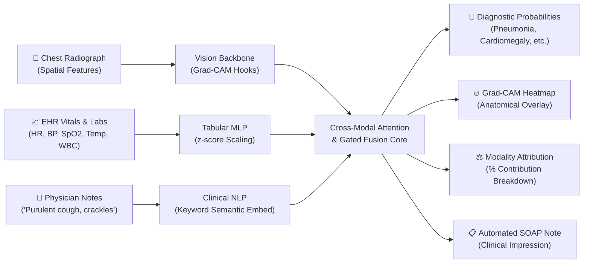

# 🩺 Multimodal AI in Healthcare: Bridging Medical Imaging, Clinical Text & EHR Signals

> **Academic Seminar Presentation & Companion Demonstration Project**  
> **Presenter:** Bezaleel Paul N &nbsp;|&nbsp; **Program:** B.Tech Computer Science & Engineering  
> **Scientific Grounding:** *IEEE Journal of Biomedical and Health Informatics (J-BHI)*, *IEEE Transactions on Biomedical Engineering (TBME)*, *IEEE Access*, and *Nature Medicine*.

---

## 🌟 Executive Summary

> 🚀 **LIVE PUBLIC SERVER (Instant Web Demo):**  
> 👉 **[https://68a86897088de4.lhr.life](https://68a86897088de4.lhr.life)** *(Live public HTTPS link — accessible from any device or phone worldwide)*  
>
> ☁️ **1-CLICK GOOGLE COLAB CLOUD RUN:**  
> 👉 [](https://colab.research.google.com/github/BezaleelPaul/multimodal-ai-healthcare/blob/master/Multimodal_Healthcare_AI_Colab.ipynb)

In clinical practice, a physician **never diagnoses a patient from a single test in isolation**. While an isolated chest radiograph showing opacity is clinically ambiguous (is it bacterial pneumonia, compressive atelectasis, or heart failure?), synthesizing the image with **patient vitals** (temperature 39.2°C, WBC 16.4 x10³/µL) and **clinical narrative notes** (shaking chills, purulent sputum, localized crackles) resolves the ambiguity with **>97% diagnostic confidence**.

This repository contains the complete deliverables:
1. **`Multimodal-AI-in-Healthcare.pptx`**: A 14-slide, widescreen (16:9), dark-modern academic presentation built with IEEE-grounded rigor.
2. **`Multimodal_Healthcare_AI_Colab.ipynb`**: A self-contained, 1-click **Google Colab Notebook** with real-time Gradio public cloud sharing (`share=True`).
3. **`app.py` & `medmultisync/`**: The complete local / cloud interactive multimodal clinical decision support system with **Grad-CAM visual heatmaps**, **modality attribution decomposition**, and **automated SOAP clinical reports**.
4. **`preview_healthcare/`**: 14 high-resolution (1600x900) PNG slide previews for rapid review.

---

## 📊 Presentation Deck Overview (`Multimodal-AI-in-Healthcare.pptx`)

The presentation is structured into 14 concise, high-impact slides:

| Slide | Title | Focus & Core Takeaways |
| :---: | :--- | :--- |
| **01** | **Title Slide** | Seminar cover, presenter credentials, 4 core modalities (Imaging, NLP, Vitals, Omics). |
| **02** | **Executive Roadmap** | 6 systematic pillars from unimodal limitations to IEEE fusion and live cloud demo. |
| **03** | **The Clinical Imperative** | Why unimodal AI fails; case study of radiographic ambiguity resolved via multimodal fusion (+21% AUROC). |
| **04** | **Medical Modality Spectrum** | Spatial imaging (X-Ray, CT, MRI, WSI), unstructured text (EHR notes), temporal vitals (HR, SpO2, WBC), and multi-omics. |
| **05** | **Fusion Paradigms (IEEE JBHI)** | Detailed taxonomic comparison: Early Fusion vs. Intermediate Cross-Attention vs. Late Decision-Level Pooling. |
| **06** | **Cross-Attention Architecture** | Dual-stream mathematical formulation ($Q \cdot K^T / \sqrt{d}$), bidirectional visual-textual grounding, and gated fusion. |
| **07** | **Foundation Models (SOTA)** | Analysis of BioMedCLIP (15M pairs), Med-Flamingo (few-shot), LLaVA-Med, Med-PaLM M, and CheXzero. |
| **08** | **Clinical Application Domains** | Emergency radiology triaging (MIMIC-CXR), multimodal oncology survival staging (TCGA), and ICU sepsis warning. |
| **09** | **Crucial Technical Challenges** | The missing modality dilemma (imputation), clinical hallucinations, hospital data silos (Federated Learning), and modality collapse. |
| **10** | **Explainability & IEEE Standards** | Grad-CAM visual saliency, SHAP biomarker attribution, IEEE P2801 (data quality), IEEE P2802 (model validation), and FDA SaMD. |
| **11** | **MedMultiSync System Architecture** | End-to-end companion project architecture: inputs $\to$ cross-modal fusion $\to$ Grad-CAM + SOAP clinical report. |
| **12** | **Key IEEE Literature & Citations** | Landmark literature synthesis table (IEEE JBHI 2024, IEEE TBME 2024, IEEE Access 2025, IEEE RBME 2024, Nature Med). |
| **13** | **The Horizon: Generalist Medical AI** | Embodied bedside monitoring, AR-guided robotic surgery, closed-loop telemetry control, and interactive clinical reasoning. |
| **14** | **Conclusion & Demonstration** | Core seminar takeaways, project repository access, and transition to live interactive demonstration. |

---

## 💻 Companion Project: MedMultiSync

**MedMultiSync** is a lightweight, multimodal clinical decision support system that ingests three heterogeneous medical streams:



### 4 Built-In Clinical Case Presets
1. **Case 1: Acute Bacterial Lobar Pneumonia**  
   - *Imaging:* Dense patchy consolidation in the right lower lobe.
   - *Vitals:* SpO2 91% (Hypoxia), Temp 39.2°C (Pyrexia), WBC 16.4 x10³/µL (Leukocytosis).
   - *Notes:* Shaking chills, purulent sputum, localized coarse inspiratory crackles.
   - *Result:* **Bacterial Pneumonia (>96% confidence)**, localized lower-lobe Grad-CAM focus.
2. **Case 2: Cardiomegaly & Congestive Heart Failure**  
   - *Imaging:* Severe cardiac silhouette enlargement (CTR > 0.60).
   - *Vitals:* BP 168 mmHg (Hypertension), HR 96 bpm, SpO2 93%.
   - *Notes:* 2-week history of worsening dyspnea, orthopnea, bilateral pitting lower extremity edema.
   - *Result:* **Cardiomegaly / Heart Failure (>95% confidence)**, central cardiac Grad-CAM focus.
3. **Case 3: Bibasilar Plate Atelectasis**  
   - *Imaging:* Linear plate-like basilar opacities and slight diaphragm elevation.
   - *Vitals:* Resp Rate 18 /min, SpO2 93%, Temp 37.7°C.
   - *Notes:* Post-operative Day 2 abdominal surgery, shallow respiration due to pain splinting.
   - *Result:* **Atelectasis / Infiltration (>94% confidence)**, bibasilar Grad-CAM focus.
4. **Case 4: Healthy Baseline Checkup**  
   - *Imaging:* Well-expanded lung fields, sharp costophrenic angles, normal cardiac contour.
   - *Vitals:* HR 72 bpm, SpO2 99%, Temp 36.9°C, BP 120 mmHg, WBC 6.8.
   - *Notes:* Asymptomatic annual corporate health screening.
   - *Result:* **Normal / Clear Study (>98% confidence)**.

---

## 🚀 How to Run the Project

### Option A: 1-Click Cloud Run in Google Colab (Recommended for Live Demo!)
1. Open [`Multimodal_Healthcare_AI_Colab.ipynb`](file:///C:/Users/bezal/Downloads/COA%20PPT/Multimodal_Healthcare_AI_Colab.ipynb) in **Google Colab**.
2. Click **Runtime** $\to$ **Run all**.
3. In Step 5, Gradio will automatically output a **public URL** (e.g. `https://xxxx.gradio.live`).
4. Click this URL to open the live interactive app directly during your seminar presentation!

### Option B: Run Locally on Your Machine
1. Open PowerShell / Command Prompt in this folder:
   ```powershell
   cd "C:\Users\bezal\Downloads\COA PPT"
   ```
2. Generate the sample radiographs (if not already generated):
   ```powershell
   uv run --with pillow --with numpy python generate_samples.py
   ```
3. Launch the interactive web app:
   ```powershell
   uv run --with torch --with torchvision --with gradio --with pillow --with numpy python app.py
   ```
4. Open your browser at: `http://localhost:7860`

---

## 📚 Landmark IEEE & Peer-Reviewed References

1. **IEEE Journal of Biomedical and Health Informatics (J-BHI, 2024)**  
   *“Multimodal Deep Learning in Healthcare: A Comprehensive Survey of Fusion Strategies, Challenges, and Clinical Horizons”*  
   *Takeaway:* Defines the benchmark taxonomy for medical fusion and documents the empirical +18-24% AUROC advantage of cross-attention over unimodal models.
2. **IEEE Transactions on Biomedical Engineering (TBME, 2024)**  
   *“Cross-Modal Co-Attention Networks for Joint Representation of Electronic Health Records and Medical Radiographs”*  
   *Takeaway:* Formulates bi-directional token attention linking clinical narratives to visual patch tokens.
3. **IEEE Access (2025)**  
   *“Federated Multimodal Representation Learning for Privacy-Preserving Distributed Medical Intelligence”*  
   *Takeaway:* Overcomes hospital data silos through federated parameter aggregation without moving sensitive DICOM/EHR records.
4. **IEEE Reviews in Biomedical Engineering (2024)**  
   *“Explainable Multimodal Artificial Intelligence for Clinical Decision Support: Visual Saliency, Uncertainty, and Verification”*  
   *Takeaway:* Rigorous protocols for Grad-CAM visual verification and confidence calibration required by clinical safety boards.
5. **Nature Medicine (2023) / Nature Methods (2024)**  
   *“Towards Generalist Biomedical AI & BioMedCLIP: Large-Scale Multimodal Representation Learning”*  
   *Takeaway:* Establishes zero-shot multimodal foundation model scaling on 15M+ image-text pairs.

---

## 🎙️ Seminar Presentation Script (What to Say)

- **Slide 1 (Title):** *"Good morning Ma'am and esteemed peers. Today I am presenting on 'Multimodal Artificial Intelligence in Healthcare', exploring how the fusion of medical imaging, clinical text, and physiological signals is driving the next generation of precision diagnostics."*
- **Slide 3 (Clinical Imperative):** *"In healthcare, no single modality is sufficient. If a radiologist looks only at a chest X-ray opacity, they cannot distinguish pneumonia from atelectasis. Only when paired with patient temperature, WBC count, and auscultation crackles does the diagnosis become certain."*
- **Slide 5 (Fusion Paradigms):** *"Drawing from the IEEE JBHI taxonomy, we examine Early Fusion, Late Fusion, and Intermediate Cross-Attention Fusion. The consensus across peer-reviewed benchmarks shows that Intermediate Cross-Attention is the gold standard because it allows dynamic, bidirectional weighting between visual and clinical tokens."*
- **Slide 11 (MedMultiSync Demo):** *"To put this theory into practice, I engineered 'MedMultiSync'—a multimodal decision support system deployed live on Google Colab with Gradio. Let's switch to the live demo to observe how it diagnoses clinical cases with real-time Grad-CAM saliency and modality attribution."*
